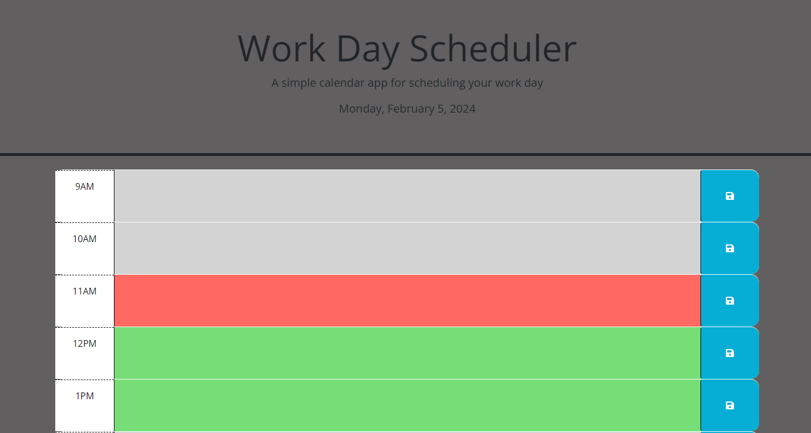
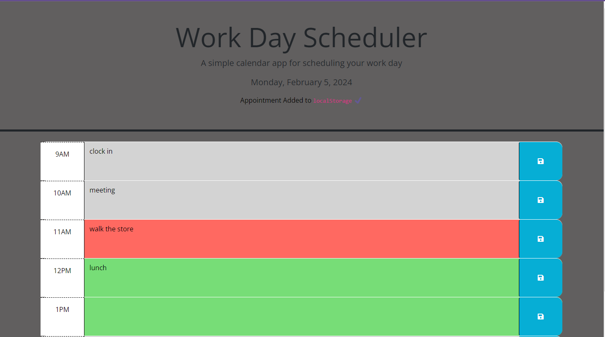

# work-scheduler

For this assignment, I was instructed to create a digital planner to track my work tasks for a 9am-5pm job. This assignment displays the usage of Dayjs, HTML, CSS, localStorage, and jQuery. 

## USER STORY

AS A employee with a schedule that is freaquently changing every day
I WANT to add my daily tasks to a digital planner 
SO THAT i can track my tasks as the day goes

## ACCEPTANCE CRITERIA

GIVEN I am using this digital planner to create my schedule for the day

WHEN I open the application to the digital planner

THEN todays date is displayed at the top of the page as well as the planners title "Work Day Scheduler"

WHEN I view the whole application 

THEN it shows my work hours from 9AM to 5PM

WHEN I see that the hours are different colors

THEN I understand that Grey is past, RED is current, and Green is the future time

WHEN I click the hour I would like to add information to

THEN I am able to enter what information is needed for that hour

WHEN I am finished entering the information 

THEN I am able to save my information using the button on the side

WHEN the information is saved

THEN I am presented with "Appointment added to local storage"

WHEN the information is saved 

THEN I can continue with the rest of my schedule and repeate the process

## MOCK UP

## AKNOWLEDGEMENTS
resources used 

https://day.js.org/docs/en/display/format

## LINKS

https://github.com/amanda-er/work-scheduler.git

https://amanda-er.github.io/work-scheduler/
